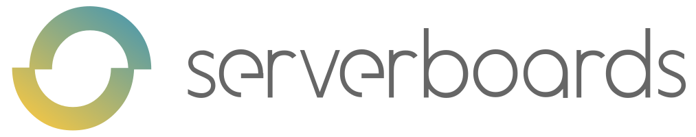
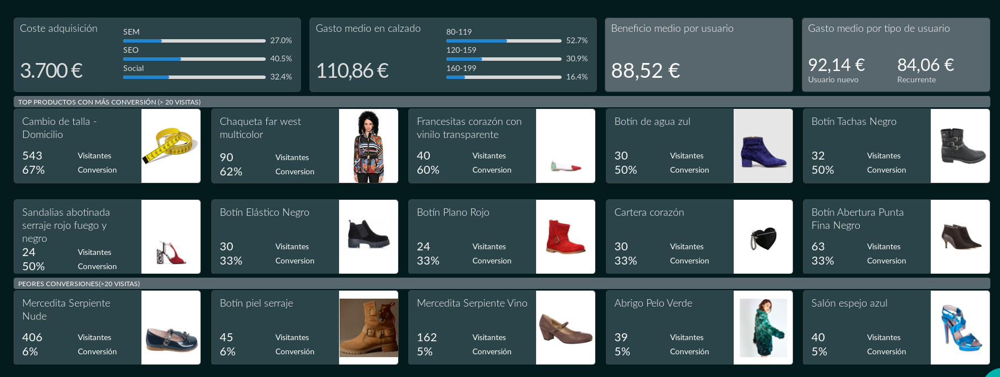
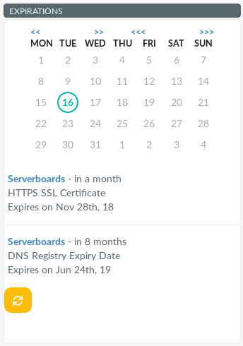
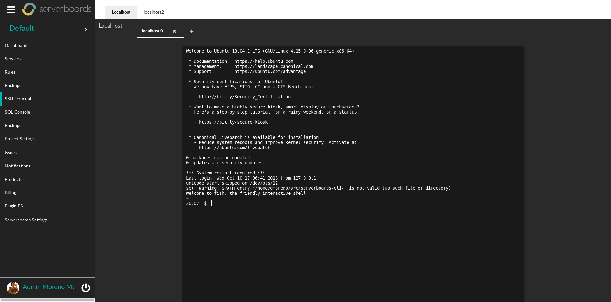
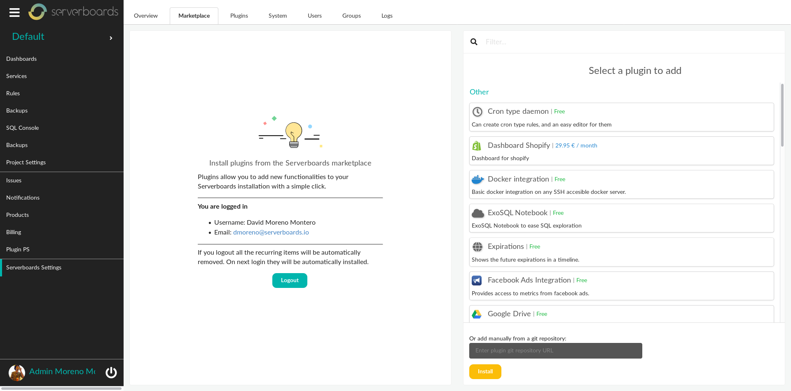
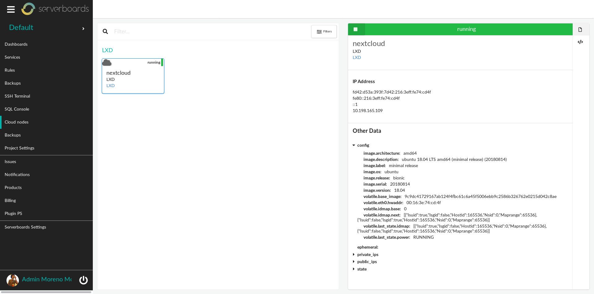

# Serverboards Plugins

  

This repository is an assortment of the Open Source packages for
[Serverboards](https://github.com/serverboards/serverboards).

Serverboards is an Enterprise Service Bus that allows to interconnect all your
services and make them talk each other. The main element are Dashboards and
extractors. Some examples from this repository:

* Dashboards

  

* Widgets

  

* Custom screens

  

* These plugins are already at the [Serverboards marketplace](https://serverboards.app/packages/)

  

* Plugins can use other plugins to expand their functionalities

  

* Services

  
  
  
  
  

  and more.

* Extractors

  
  
  

  and more.

Packages can be easily installed at Serverboards itself (settings / marketplace)
or using the `s10s` command line command.

If you are interested in developing new plugins, be them free of for-pay, please
check the documentation at
[Serverboards.io/developers](https://serverboards.io/developers/). It is very easy.

# Contributions

Please, feel free to contribute in any means you can. Pull requests, fill
issues, create documentation, spread the word. If you can help in any mean,
thank you.

If you develop a new OSS plugin and think the community can benefit from it
being included here, please create an Issue describing the package, why you
think it should be there and so on.

The only requirements are:
* contributed code maintains the Apache2 license
* we follow the [Contributor Covenant](https://www.contributor-covenant.org/version/1/4/code-of-conduct.html)
  code of conduct.

# License

You can do what you like with the software, as long as you include the required
notices. This permissive license contains a patent license from the contributors
of the code. https://tldrlegal.com/license/apache-license-2.0-(apache-2.0)

Check the [LICENSE](LICENSE) file for the full license text.

Individual assets, logos and brands are property of the respective owners, and
are used for descriptive use for eachs plugins use.
